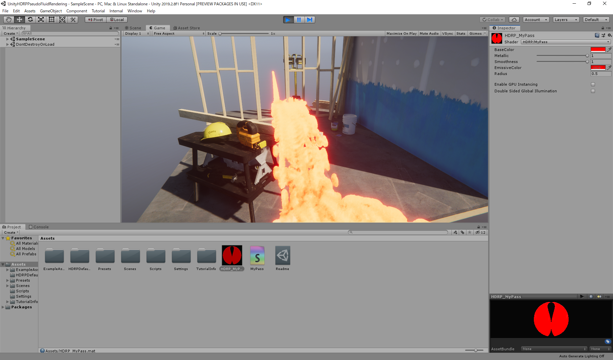

# UnityHDRPPseudoFluidRendering


[youtube](https://www.youtube.com/watch?v=d3HQm0LftHo)

Implementation of [this slide](http://developer.download.nvidia.com/presentations/2010/gdc/Direct3D_Effects.pdf).

## Getting Started

Clone this repository.

```
git clone https://github.com/MatchaChoco010/UnityHDRPPseudoFluidRendering.git
```

Open the project.



## Version

- Unity: 2019.2.8f1
- HDRP: 6.9.1 with some custom

## blog

[UnityのHDRPを改造し擬似的な流体のレンダリングを行うパスを追加する | 測度ゼロの抹茶チョコ](https://matcha-choco010.net/2019/09/28/unity-hdrp-custom-pseudo-fluid/)
